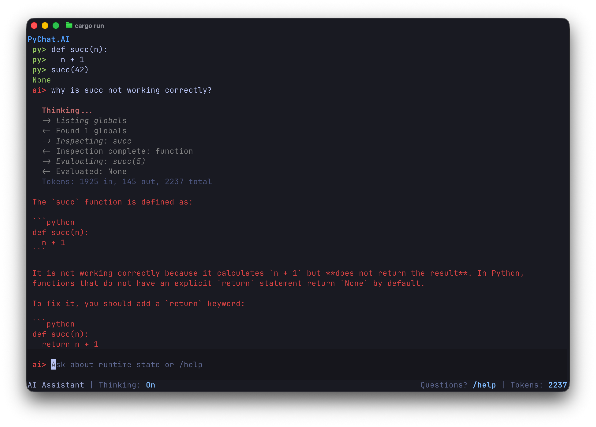

# PyChat.ai

PyChat.ai is an interactive Python REPL that embeds an LLM agentic loop, which has access to the Python environment and can query a value or run code.



Please see the accompanying [blog post](https://andreabergia.com/blog/2026/02/pychat-ai/) for more information.

## Important

- This is a **prototype** at the moment, to explore the idea. It is not a full product!
- This is **very insecure** - the model can run arbitrary Python code, so it can read your file system or use the network, which makes it susceptible to the [lethal trifecta](https://simonwillison.net/2025/Jun/16/the-lethal-trifecta/). Please don't use this outside of a container or virtual machine!

## What You Can Do

- Run Python code
- Switch between Python mode and assistant mode with `Tab`
- Ask assistant questions grounded in the current runtime
- Use slash commands for quick inspection and session operations

## License

[AGPL v3.0](LICENSE)

## Quick Start

### Requirements

- Rust toolchain
- either `uv` for the pinned Python workflow used in CI, or Python installed locally
- `GEMINI_API_KEY` if you want assistant responses. You can get one, which has a free tier, [Google AI Studio](https://aistudio.google.com/app/api-keys)

### Reproducible Checks (Pinned Python, Optional)

CI uses a pinned Python version from `.python-version` installed via `uv`.

Use this workflow if you want reproducible local checks (`fmt`, `clippy`, `test`) with the same Python version as CI.
If you just want to try the app, you can skip this section and use `cargo run` below.

Install the pinned Python:

```bash
scripts/python/install-managed-python.sh
```

Run project checks with the pinned interpreter:

```bash
scripts/dev/checks-with-pinned-python.sh
```

Print PyO3 interpreter config (debugging):

```bash
scripts/dev/pyo3-config-check.sh
```

### Run

Remember - this is **insecure**! Do this in a container or vm!

The commands below are the simplest local run path. They use your local Python/PyO3 setup (unless you set `PYO3_PYTHON` yourself).

```bash
cargo run
```

With assistant enabled:

```bash
GEMINI_API_KEY=your_key cargo run
```

You can also set `GEMINI_API_KEY` in `.env`.

## Basic Usage

- Enter Python code and press `Enter`
- Press `Tab` to switch modes
- Type `/help` to see commands
- Type `exit` or `quit` to leave

## Docs

- User guide: `docs/user-guide.md`
- Config reference: `docs/config-reference.md`
- Command reference: `docs/command-reference.md`
- Contributing: `docs/contributing.md`
- Architecture: `docs/architecture.md`

## Target Users

- Python learners
- Data scientists
- Developers working interactively
- Anyone who frequently uses Python REPL

## Use Cases

- Learning Python: understand objects/functions interactively, explore built-ins
- Debugging: inspect variable state, understand exceptions, check assumptions
- Data exploration: inspect data structures, summarize collections
- Interactive experimentation: prototype ideas, verify behavior, explore APIs
